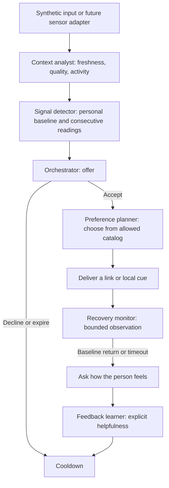

# Synthetic calming workflow lab

This lab tests the user-requested loop without Oura or model credentials: give the workflow readings, detect a sustained percentage change from a personal baseline, offer a break, choose a calming suggestion after acceptance, monitor later readings, and ask for feedback. It is isolated under `test/synthetic_lab/`, owned by the coord lane. It does not implement or replace the production contracts, calibration, state detector, or rep protocol being built by the other lanes.

## Run it

Requires Python 3.10 or newer; all runtime and tests use the standard library. From the repository root:

```powershell
cd test/synthetic_lab
python -m peak_state serve --port 8765
```

Open [the local demo](http://127.0.0.1:8765). Load a scenario, adjust thresholds/preferences, and accept, decline, or expire an offer. Acceptance replays subsequent synthetic readings immediately. Helpful/unhelpful feedback and the separate "I feel calmer" checkbox are real visitor choices. Preference history lasts for the browser page session, can be reset, and is included in downloaded replay JSON; it is not a durable personal profile.

CLI commands from that same directory:

```powershell
python -m peak_state generate
python -m peak_state run --scenario recovery --output tmp/recovery-trace.json
python -m peak_state run --input examples/synthetic/hrv_only.json
python -m unittest discover -s tests -v
```

CLI fixture actions are marked `simulated_user`. A synthetic recovery trace is never recorded as a real person's successful intervention. Run `generate` again to reproduce all nine fixtures byte for byte.

## Workflow and component boundaries



These are local deterministic components, not autonomous LLM calls. The model-ready boundary is the preference planner: it receives declared preferences and explicit feedback and returns a catalog selection. A future model could conduct a conversation to collect preferences or rank allowed catalog IDs. The orchestrator must still own acceptance, timers, thresholds, and state changes. Validate a model's selection against the catalog; do not let it invent external URLs, diagnose stress, or bypass the acceptance gate.

| Component | Current implementation | Extension point |
|---|---|---|
| Input adapter | `scenarios.py`, private JSON fixtures | Normalize sensor values and source/measurement context |
| Context analyst | `Workflow._sample` guards | Oura freshness, workout interval + 15-minute buffer, quiet hours |
| Signal detector | Fixed personal baseline, configurable percentage comparisons | Validated personal calibration and comparable measurement windows |
| Orchestrator | Explicit per-person state machine | Durable state, acceptance UI, queues, deduplicated events |
| Preference planner | `PreferencePlanner.choose`, local catalog ranking | Conversational preference intake or model-selected catalog ID |
| Delivery | User-opened YouTube search or local breathing/color cue | Person-approved video IDs and provider references |
| Recovery monitor | Two consecutive readings within baseline bands; timeout | Sensor adapter with appropriate cadence and coverage |
| Feedback learner | Declared helpfulness changes future catalog ranking | Durable feedback history, explicit corrections, evaluation |

## Input and baseline

The profile in `test/synthetic_lab/examples/calming-profile.json` is invented. It declares heart-rate baseline 62 bpm, synthetic intraday HRV baseline 52 ms, and the requested preferences: funny videos, meditation music, and breathing. Baselines are frozen during an episode so elevated readings cannot train away the signal. The minimum of 30 baseline observations is a demo guard, not a validated calibration rule.

An input sample looks like this:

```json
{
  "type": "sample",
  "observed_at": "2026-10-03T14:10:00+00:00",
  "received_at": "2026-10-03T14:10:30+00:00",
  "hr_bpm": 81,
  "hrv_ms": 33,
  "source": "awake",
  "hrv_context": "synthetic_intraday",
  "activity": "rest",
  "quality": "good",
  "available": true,
  "provenance": "synthetic"
}
```

Measurement time and receipt time are distinct; timestamps require offsets. Missing HR or HRV is `null`, never zero. Source and HRV context must match the corresponding baseline. `sleep_average` HRV therefore cannot trigger against `synthetic_intraday`. Activity states `workout` and `post_workout` suppress readings; the synthetic adapter labels them explicitly. An actual adapter must calculate workout intervals and the buffer, not rely on an arbitrary label from a model.

This is a private lab input format, not a second cross-lane SignalFrame contract. A production integration must use the contracts lane's approved schemas.

## Threshold and recovery policies

Percentage change is `100 * (current / baseline - 1)`.

- Raise an offer when HR is at least 20% above baseline **or** comparable HRV is at least 25% below baseline, on two consecutive eligible readings of the same metric.
- Require accepted input before choosing or delivering content. An unanswered offer expires after ten simulated minutes. Decline, stop, or completed feedback starts a four-hour cooldown.
- After acceptance, return-to-baseline requires two consecutive readings of each triggering metric within the baseline band: HR ±10%, HRV ±15%. It raises a check-in, not a claim that the person is emotionally calm.
- Monitoring ends after twenty simulated minutes if recovery has not been confirmed. A `tick` input advances timers even when readings stop arriving. A real scheduler must emit ticks; there is no background ring monitor in the lab.
- Missing triggered metrics cannot prove recovery. A gap longer than six minutes resets consecutive counts. Samples older than ten minutes, future timestamps, poor quality, duplicates, and out-of-order observations cannot count as evidence.
- The same measurements can come from exercise, illness, caffeine, or other causes. The workflow records a physiological deviation with cause unknown.

These numbers are configurable demo policies. They are not clinical thresholds or evidence that a particular intervention works. The engine does not learn helpfulness from biometric changes alone: it saves explicit `helpful` and `feels_calmer` feedback separately. A negative helpfulness rating reduces that item's rank, so the next replay can select music instead of humor.

## Fixtures

| Scenario | Expected behavior |
|---|---|
| `recovery` | Both signals cross, offer accepted, measurements return, simulated feedback closes episode |
| `hr_only` | HR-only trigger and recovery, without invented HRV readings |
| `hrv_only` | HRV decreases, then increases toward baseline |
| `workout` | Exercise and post-workout buffer suppress offers |
| `spike` | One elevated observation does not trigger |
| `missing_data` | Monitoring times out when readings stop |
| `no_recovery` | Sustained deviation ends with a check-in, without a recovery claim |
| `declined` | Offer closes without delivering content |
| `sleep_hrv` | Sleep-average HRV is not compared with an intraday baseline |

## Oura and media limits

Lower-than-baseline HRV can accompany stress, and recovery may bring it toward the person's usual range. HRV alone does not identify emotional state. [Oura's explanation](https://ouraring.com/blog/hrv-and-stress/).

The fixture's five-minute intraday HRV stream is invented for workflow testing. Oura's REST heart-rate series does not contain HRV; sleep-average HRV is useful for morning context, not a live daytime recovery loop. A real short-loop HRV demo needs another appropriate source, such as validated RR-interval measurements from a compatible heart-rate sensor. Actual Oura integration remains a separate work item in [oura-import-plan.md](oura-import-plan.md).

YouTube outputs are clearly labeled search links, not vetted video recommendations. The prototype does not fetch search results, select a particular video, autoplay media, upload biometric data, or call a model. Approved media references and user preference intake remain extension work.
